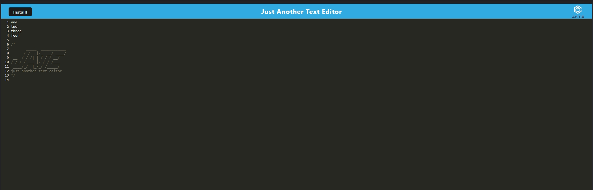
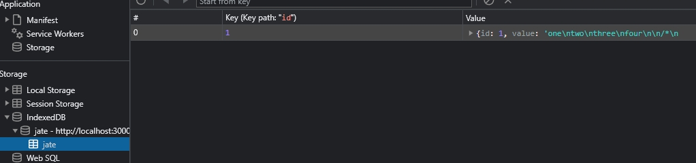

# text-editor
A text editor that can run in the browser and can store data for offline use.

A link to the deployed app can be found [here](https://damp-castle-49314.herokuapp.com/)

## Screenshot

## Features

- Built with Node, Express, and various Webpack plugins.
- Users can add/edit texts in the editor.
- Texts are saved in the browser's indexedDB, they'll be restored upon reload.
- Users can also install the app for offline use.

## Table of Contents 

* [Installation](#installation)

* [Usage](#usage)

* [License](#license)

* [Contributing](#contributing)

* [Tests](#tests)

* [Questions](#questions)

## Installation

To install necessary dependencies, run the following command:
~~~
npm run install
~~~

And then compile the app with:

~~~
npm run build
~~~

## Usage

Perform a git clone and run the code with "npm start"

## License

MIT

## Contributing

Fork the repo and create pull requests

~~~
npm run start:dev
~~~

## Tests

To run tests, run the following command:
~~~
npm test
~~~
## Questions

If you have any questions about the repo, open an issue or contact me directly at Algarvian2001@yahoo.com. You can find more of my works at [NganPham89](https://github.com/NganPham89).

